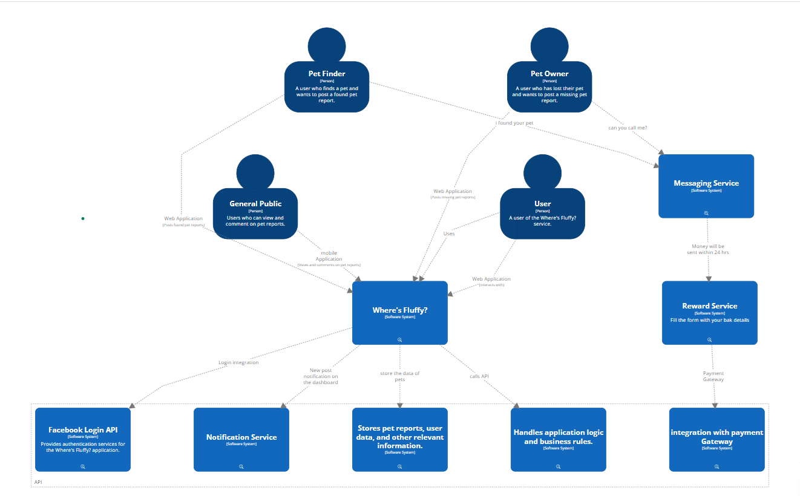

ifndef::imagesdir[:imagesdir: ../images]

[[section-system-scope-and-context]]
== System Scope and Context

=== Business Context

# image::embed:SystemContext[]

Users::

1. Pet Owners                  
2. Pet Finders                 
3. General Users               
4. Local Business

Where's Fluffy?::

1. User Management             
2. Pet Listing and Management  
3. Pet Finder Interactions     
4. Reward Management           
5. Location Services           
6. Notifications and Communication                         |

**Explanation of external domain interfaces>**

1. External Services (APIs)
2. GPS/Location Services (e.g., Google Maps API)          
3. Notification Services (e.g., Firebase Cloud Messaging) 
4. Payment Services (e.g., Stripe, PayPal)   

=== Technical Context

1. End Users
2. Frontend 
** Web Application (React)
** Mobile Application (React Native/Flutter)
3. Backend
** API Gateway (Node.js/Express or Django)
** Microservices
*** User Management Service
*** Pet Listing Service
*** Pet Finder Interaction Service
*** Reward Management Service
*** Location Service
*** Notification Service
4. Databases
** MongoDB
5. External Services (APIs)
** GPS/Location Services (e.g., Google Maps API)
** Notification Services (e.g., Firebase Cloud Messaging)
** Payment Services (e.g., Stripe, PayPal)

# **<optionally: Explanation of technical interfaces>**

# **<Mapping Input/Output to Channels>**

User Input::

Users interact with the platform via web or mobile apps.

Web Application::

User inputs are sent to the API Gateway, which routes them to appropriate microservices.

Mobile Application:: 

User inputs are sent to the API Gateway, which routes them to appropriate microservices.

System Output::

Web Application::

The frontend displays responses from the backend services, such as pet listings, notifications, and user profiles.

Mobile Application:: 

The mobile app displays responses from the backend services, such as pet listings, notifications, and user profiles.

Notifications::

Push Notifications:: 

Sent via Firebase Cloud Messaging to notify users about new sightings, comments, and messages.

Email Notifications:: 

Sent via an email service (e.g., SendGrid) for important updates and alerts.

Payments::

Payment Transactions::

Processed via Stripe or PayPal, with confirmations sent back to the Reward Management Service.